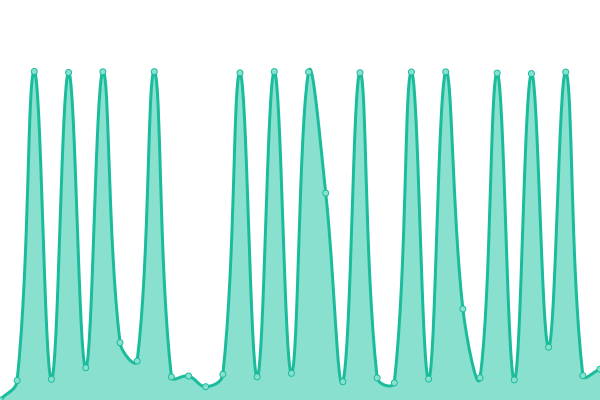

# [📈 Live Status](https://aribatturan.github.io/hcdev): <!--live status--> **🟩 All systems operational**

This repository contains the open-source uptime monitor and status page for [aribatturan](https://aribatturan.github.io/hcdev), powered by [Upptime](https://github.com/upptime/upptime).

With [Upptime](https://upptime.js.org), you can get your own unlimited and free uptime monitor and status page, powered entirely by a GitHub repository. We use [Issues](https://github.com/aribatturan/hcdev/issues) as incident reports, [Actions](https://github.com/aribatturan/hcdev/actions) as uptime monitors, and [Pages](https://aribatturan.github.io/hcdev) for the status page.

<!--start: status pages-->
<!-- This summary is generated by Upptime (https://github.com/upptime/upptime) -->
<!-- Do not edit this manually, your changes will be overwritten -->
<!-- prettier-ignore -->
| URL | Status | History | Response Time | Uptime |
| --- | ------ | ------- | ------------- | ------ |
|  [kahve.com](https://www.kahve.com) | 🟩 Up | [kahve-com.yml](https://github.com/aribatturan/hcdev/commits/HEAD/history/kahve-com.yml) | 

 1825ms
     
 | 

<a href="https://aribatturan.github.io/hcdev/history/kahve-com">100.00%</a>
    

|  [borataktik](https://www.borataktik.com) | 🟩 Up | [borataktik.yml](https://github.com/aribatturan/hcdev/commits/HEAD/history/borataktik.yml) | 

 941ms
     
 | 

<a href="https://aribatturan.github.io/hcdev/history/borataktik">100.00%</a>
    

|  [ideasoft test site](https://ops.ideasoft.dev) | 🟩 Up | [ideasoft-test-site.yml](https://github.com/aribatturan/hcdev/commits/HEAD/history/ideasoft-test-site.yml) | 

 603ms
     
 | 

<a href="https://aribatturan.github.io/hcdev/history/ideasoft-test-site">100.00%</a>
    

<!--end: status pages-->

[**Visit our status website →**](https://aribatturan.github.io/hcdev)

## 📄 License

- Powered by: [Upptime](https://github.com/upptime/upptime)
- Code: [MIT](./LICENSE) © [aribatturan](https://aribatturan.github.io/hcdev)
- Data in the `./history` directory: [Open Database License](https://opendatacommons.org/licenses/odbl/1-0/)
